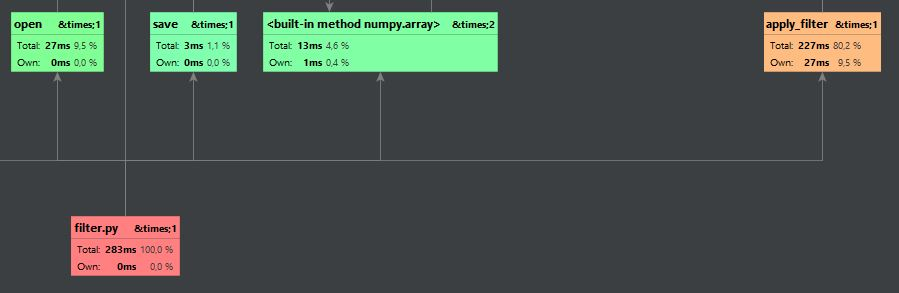
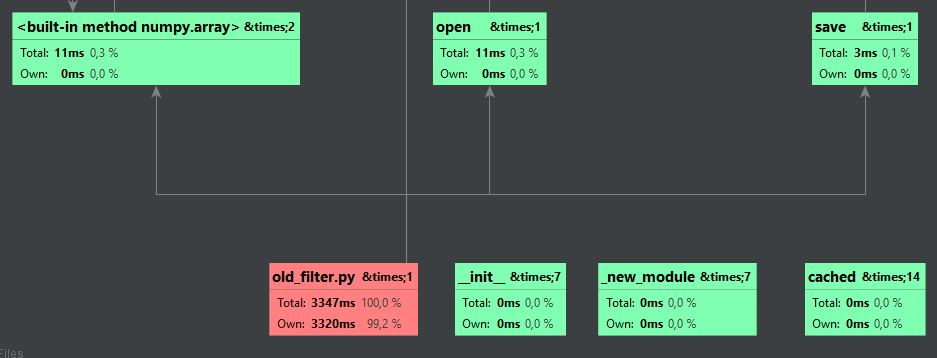
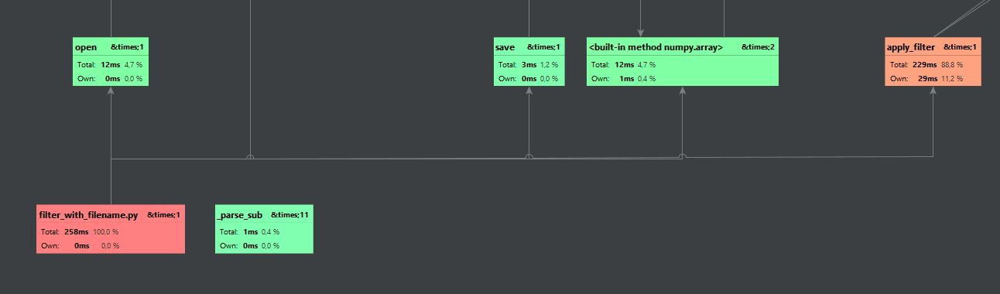
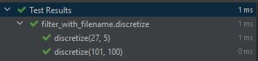

# PyCharmDemo
Задание от 16.11.2021. Ознакомление с IDE PyCharm

 
*Время выполнения filter.py*

 
*Время выполнения old_filter.py*

Прирост производительности в 10 раз вызван тем,
что функции из numpy значительно более оптимизированы
по сравнению с реализацией через циклы.

 
*Время выполнения filter_with_filename.py*

Для filter.py в профайлере указаны входные аргументы утилиты, поэтому прирост
производительности в filter_with_filename.py достаточно мал.

 
*Результат выполнения доктестов в PyCharm* 